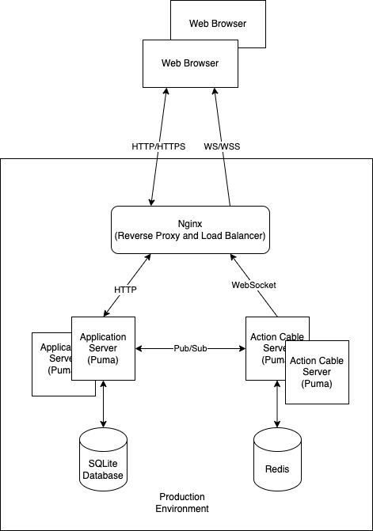
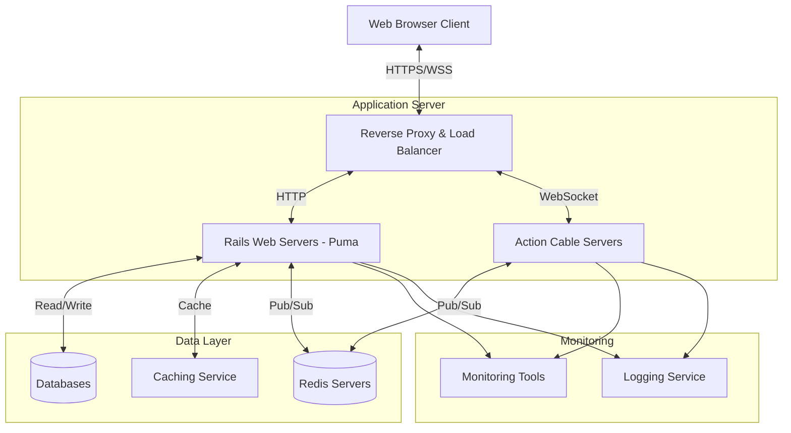
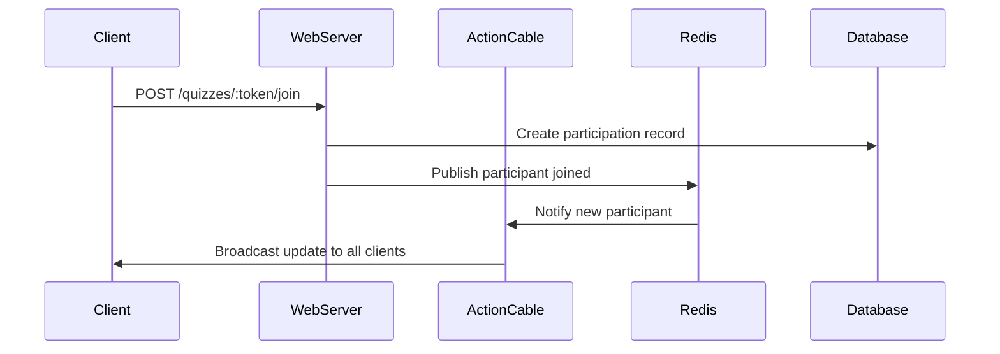

# System Design Document

## Architecture Diagram

## Key Components

### Rails Application Server
- Web Server: Puma
- Framework: Ruby on Rails 7.1.4 for RESTful APIs
- Language: Ruby 3.2.2
- Frontend framework: Hotwire Turbo, Bootstrap, Action Cable client for WebSocket connections

### Action Cable Server
- Web Server: Puma
- Framework: ActionCable for real-time communication

### Redis Server
- Pub/Sub messaging

### Databases
- SQLite Database (Development)
- PostgreSQL Database (Production)

## Data Flow

## Technology Justification

### Ruby on Rails framework
- Rapid development
- Built-in support for Action Cable
- Built-in Hotwire Turbo for frontend framework

### Action Cable framework
- Real-time communication

### Puma Web Server
- Multi-threaded web server
- Supports Action Cable

### RDBMS Databases
- SQLite (Development): Lightweight and easy to set up
- PostgreSQL (Production): for better performance and heavy load

### Redis
- Pub/Sub messaging
- Fast in-memory data store

## Scaling Considerations

### Horizontal Scaling
- Multiple Rails application servers behind a load balancer
- Separate Action Cable servers for WebSocket handling
- Redis for pub/sub ensures message consistency across servers

### Database Scaling
- Development uses SQLite for simplicity
- Production should use PostgreSQL for better performance and concurrent access
- Proper indexing on frequently accessed columns (see schema.rb)

### Caching Strategy
- Redis can be used for caching quiz data
- Action Cable subscription data stored in Redis
