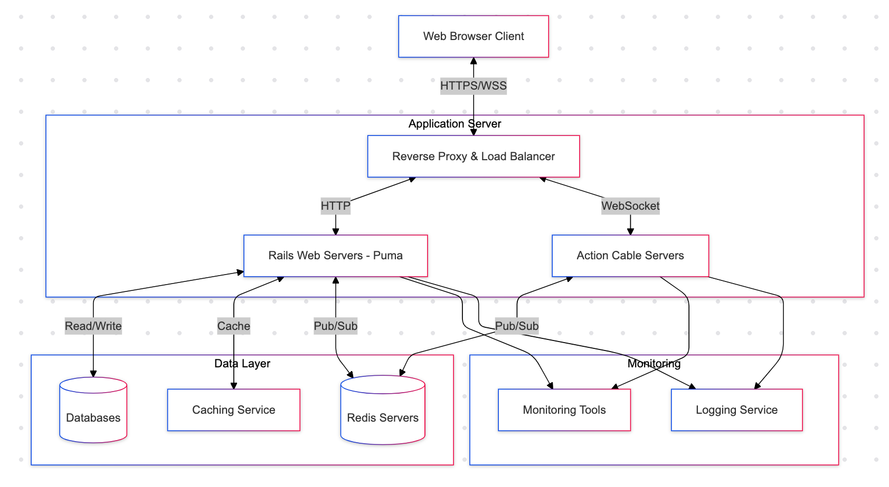
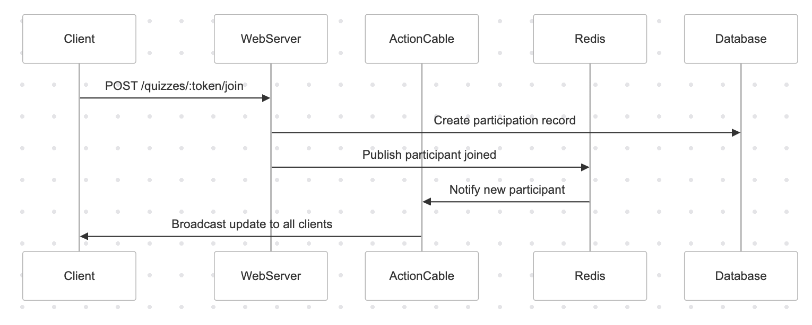

# System Design Document

## Architecture Diagram

## Components

### Rails Application Servers
- Web Server: Puma
- Framework: Ruby on Rails 7.1.4 for RESTful APIs
- Language: Ruby 3.2.2
- Frontend framework: Hotwire Turbo (part of Rails 7.1)

### Action Cable Servers
- Web Server: Puma
- Framework: ActionCable (part of Rails 7.1) for real-time communication

### Redis Server
- Pub/Sub messaging

### Databases
- SQLite Database (Development)
- PostgreSQL Database (Production)

### Data Flow

## Technology Justification

### Ruby on Rails framework
- Rapid development
- Built-in support for Action Cable
- Built-in Hotwire Turbo for frontend framework

### Action Cable framework
- Real-time communication

### Puma Web Server
- Multi-threaded web server
- Supports Action Cable

### RDBMS Databases
- SQLite (Development): Lightweight and easy to set up
- PostgreSQL (Production): for better performance and heavy load

### Redis
- Pub/Sub messaging
- Fast in-memory data store
